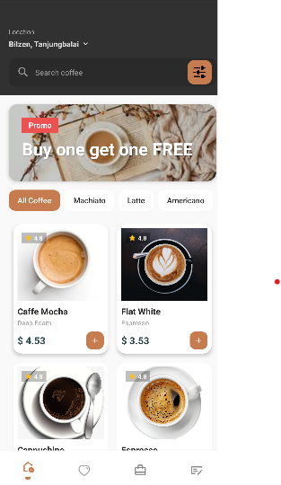
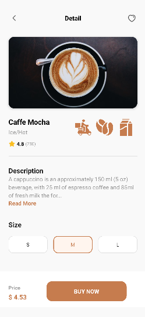
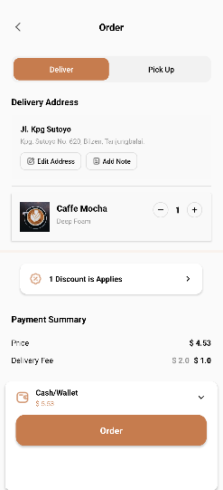

# ☕ Coffee Shop App

A beautiful and modern Android coffee shop application built with Kotlin. Browse, select, and order your favorite coffee with an intuitive and elegant user interface.


## 📱 Screenshots

<p align="center">
  
  
  
  
</p>

## 📋 App Screens

### 1. Onboarding Screen
Welcome screen with beautiful coffee imagery and a call-to-action to get started.

### 2. Home Screen
- Coffee catalog displayed in a grid layout
- Search bar to find specific coffee types
- Category filter buttons (All Coffee, Machiato, Latte, Americano)
- Promotional banner for special offers
- Bottom navigation bar for easy access

### 3. Detail Screen
- High-quality coffee image
- Coffee name and type information
- Star rating display
- Detailed description with "Read more" option
- Size selection buttons (S, M, L)
- Price display
- "Buy Now" button

### 4. Order Screen
- Order summary and details
- Final confirmation before purchase


## 📁 Project Structure

```
CoffeeShopApp/
├── app/
│   ├── src/
│   │   ├── main/
│   │   │   ├── java/com/example/coffeshop_app/
│   │   │   │   ├── HomeActivity.kt
│   │   │   │   ├── DetailActivity.kt
│   │   │   │   ├── OrderActivity.kt
│   │   │   │   └── OnBoardingActivity.kt
│   │   │   ├── res/
│   │   │   │   ├── layout/
│   │   │   │   │   ├── activity_home.xml
│   │   │   │   │   ├── activity_detail.xml
│   │   │   │   │   ├── activity_order.xml
│   │   │   │   │   └── activity_on_boarding.xml
│   │   │   │   ├── drawable/
│   │   │   │   ├── values/
│   │   │   │   └── ...
│   │   │   └── AndroidManifest.xml
│   └── build.gradle
├── screenshots/
│   ├── onboarding.png
│   ├── home.png
│   ├── detail.png
│   └── order.png
├── README.md
└── .gitignore

